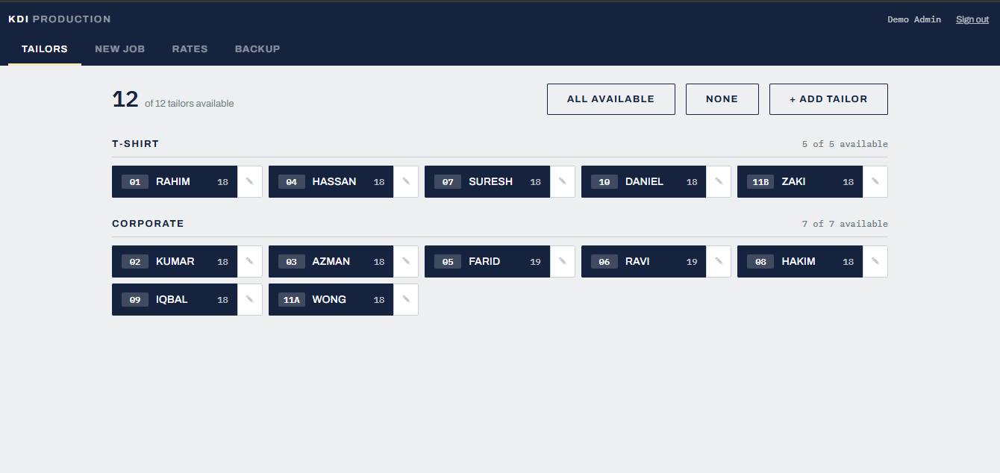
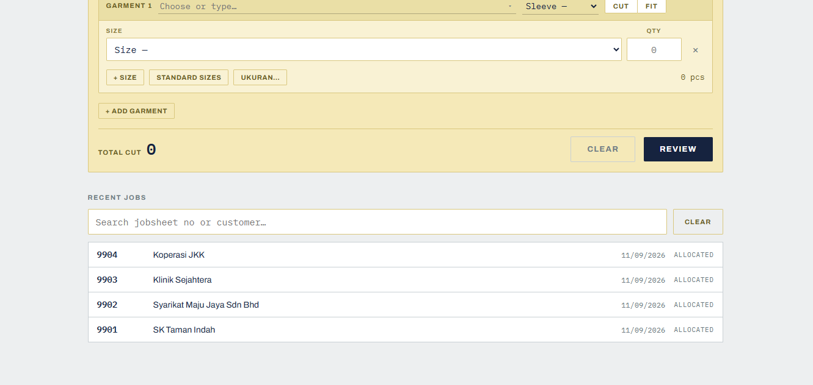
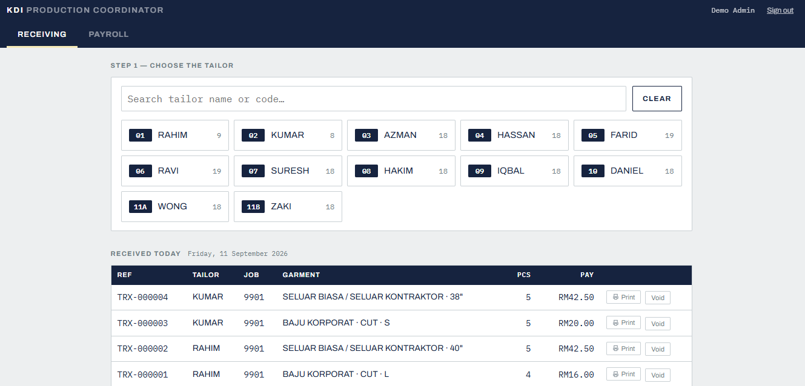
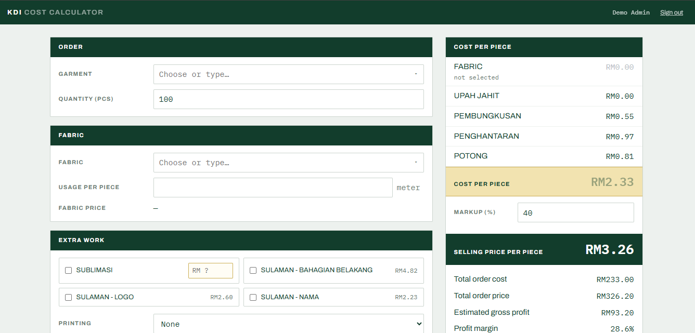

# Garment Production Management System

A web system in daily use at a garment factory in Malaysia, replacing paper receipt books and Excel spreadsheets for a production floor of 28 piece-rate tailors.

I designed, built, and maintain it as the sole developer.

> **Note:** The source code is private because it belongs to the client. This repo documents the system, its design decisions, and screenshots. All screenshots use demo data; names and jobs are not real.

---

## The problem

Tailors are paid per piece, so every garment handed out and returned affects someone's pay. Before this system:

- Work was allocated and recorded in paper receipt books, then re-typed into Excel for payroll
- There was no reliable way to see who was holding how much work
- Mistakes and corrections left no trail, so payroll disputes were hard to resolve

## What it does

The system is split into screens for each role:

| Screen | Used by | Purpose |
|---|---|---|
| **Production Supervisor** | Supervisor | Create job sheets, allocate pieces to tailors, manage piece rates, export backups |
| **Production Coordinator** | Coordinator | Record garments received back from tailors, export payroll |
| **Cost Calculator** | Management and staff | Estimate garment costs from fabric, trims, and labour |

## Screenshots

## Screenshots

*Supervisor: tailors grouped by the type of garment they sew*

*Supervisor: creating a job sheet and allocating pieces to tailors*

*Coordinator: recording garments received back from tailors*

*Cost calculator*

## Design decisions

**No build step, on purpose.**
Plain HTML and JavaScript with the Supabase client loaded from a CDN. No npm, no framework, no compile step. Any file can be opened and understood in a text editor, which matters for a system maintained by one person over many years.

**Fair allocation based on total workload.**
Splitting each job evenly looked fair, but tailors work at different speeds, so their total outstanding work drifted apart over time. Allocation now considers each tailor's total outstanding load and levels it gradually, with limits so no one's share swings too far on a single job.

**Past payroll can never change silently.**
Piece rates are never edited in place. A rate change closes the old rate and opens a new one, and every receiving record stores the rate at that moment. Changing a rate today cannot reprice last month's pay.

**Void instead of delete.**
Cancelled jobs and voided receivings stay in the database with a record of who voided them and when. Nothing that affects pay disappears without a trace.

**Security enforced in the database.**
Access rules use PostgreSQL row-level security, so they apply no matter which screen or tool touches the data. Views are configured to respect those rules rather than bypass them.

**Atomic saves.**
Saving a job sheet and allocating it happen in a single database transaction, so a dropped connection can't leave a job half-saved.

## Tech stack

- **Frontend:** HTML, CSS, JavaScript (no framework)
- **Backend:** Supabase (PostgreSQL, row-level security, stored procedures)
- **Hosting:** Cloudflare Pages
- **Database changes:** 30+ versioned SQL migrations

## My role

- Gathered requirements directly from the production supervisor and coordinator
- Designed the database schema and allocation logic
- Built and deployed all screens
- Test risky changes in a sandbox before they reach production
- Deploy updates after working hours in planned batches, so the production floor is never disrupted
